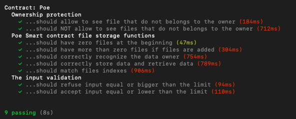

# Proof of Existence
[](https://travis-ci.org/LorenzoZaccagnini/proof-of-existence-dapp)

Try this DAPP live (Rinkeby) at [https://proofofexistence.netlify.com/](https://proofofexistence.netlify.com/)

Final Project for the ConsenSys Academy 2019 Developer Program. This Dapp allows users to store their files inside IPFS and tracking them using Ethereum blockchain. The timestamp and IPFS hash link of the file will be recorded inside the smart contract, the content of the file will be stored inside IPFS.
This kind of system is scalable and fairly cheap, allowing user to prove a file existence, if is tampered or if it's the original file they've uploaded, just looking at the hash and the timestamp.


### Prerequisites

Run ganache to emulate an ethereum node:
```
ganache-cli
```

### Installing


Clone the repo and install dependencies:
```
npm install
```

## Deploying the smart contract

Compile the contracts with truffle
```
truffle compile
```
Migrate the contracts
```
truffle migrate
```

## Frontend
Run the server:
```
npm start
```
It will open http://localhost:3000/

Remember to connect to the local ganache instance or just use the rinkeby network :)


## Tests

Run the tests:
```
truffle test
```
or

```
npm test
```

**Remember to have ganache running in the background**

All tests passed



## Rinkeby deploy

* Contract Address: [0x4d52DF1eCc8cC14a8d1427e034b6DCcF32542368](https://rinkeby.etherscan.io/address/0x4d52DF1eCc8cC14a8d1427e034b6DCcF32542368)


## Built With

* [Truffle](https://truffleframework.com/docs/truffle/overview)
* [Drizzle](https://truffleframework.com/docs/drizzle/react/react-integration)
* [Ganache-cli](https://truffleframework.com/docs/ganache/overview)
* [Metamask](https://metamask.io/)
* [OpenZeppelin - Ownable and Pausable](https://github.com/OpenZeppelin/openzeppelin-solidity/)


## License

This project is licensed under the MIT License - see the [LICENSE.md](LICENSE.md) file for details


## Author

Lorenzo Zaccagnini - [Github](https://github.com/LorenzoZaccagnini)
